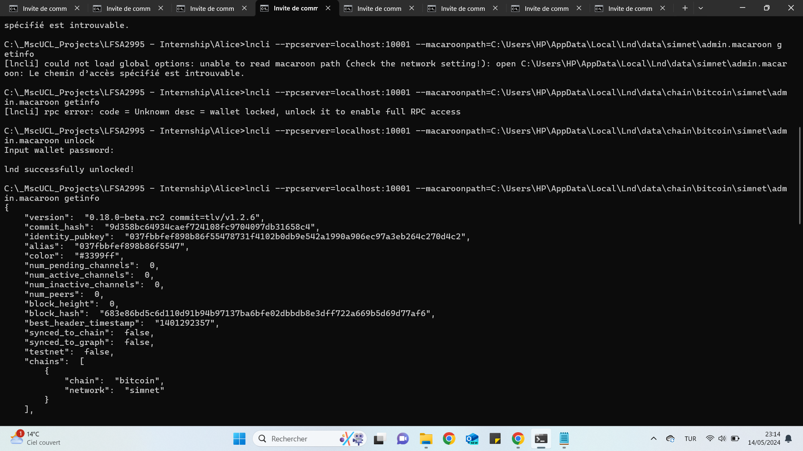

# Lightning Network - L2 Prototype 

## Introduction

The Lightning Network Prototype repository aims to provide a hands-on guide to understanding and experimenting with the Lightning Network, a layer 2 scaling solution for Bitcoin and other blockchain-based cryptocurrencies.

## Getting Started

### Setting Up a Simnet Environment

1. **Install Bitcoin and Lightning Software:**
   - Install and set up a Bitcoin node **btcd**.
     - Get started by visiting [btcd GitHub Repository](https://github.com/btcsuite/btcd) for installation instructions and setup details.
   - Install Lightning Network software **LND** (Lightning Network Daemon).
     - To install and set up LND, visit the [LND GitHub Repository](https://github.com/lightningnetwork/lnd) for detailed installation instructions.

##### **LND**
**lnd** is the main component that we will interact with. lnd stands for Lightning Network Daemon, and handles channel opening/closing, routing and sending payments, and managing all the Lightning Network state that is separate from the underlying Bitcoin network itself.

##### **BTCD**
**btcd** represents the gateway that lnd nodes will use to interact with the Bitcoin / Litecoin network. lnd needs btcd for creating on-chain addresses or transactions, watching the blockchain for updates, and opening/closing channels. In our current schema, all three of the nodes are connected to the same btcd instance. In a more realistic scenario, each of the lnd nodes will be connected to their own instances of btcd or equivalent.

2. **Initialize the Simnet:**
   - Simnet (Simulation Network) is a local test network that simulates the Bitcoin network environment.
   - Initialize the Simnet by running the Bitcoin node with the `--simnet` flag.

   ```bash
   btcd --simnet --txindex --rpcuser=username --rpcpass=password
   ```

3. **Generate Blocks:**
   - Use the Bitcoin node's RPC interface to generate blocks on the Simnet.
   - This creates an environment where we can test Lightning Network transactions.
   ```bash
   btcctl --simnet --rpcuser=username --rpcpass=password generate <number_of_blocks>
   ```

### Initialize Lightning Nodes

Use Lightning Network software **LND** to initialize Lightning nodes for Alice, Bob, and Charlie respectively on your local machine. Ensure that each node is started with unique port configurations to avoid conflicts.

To set up Lightning Network nodes for Alice, Bob, and Charlie, follow these steps:

1.**Starting lnd (Alice’s node):**
   - Run the following command for Alice's node:

   ```bash
   alice$ lnd --rpclisten=localhost:10001 --listen=localhost:10011 --restlisten=localhost:8001 --datadir=data --logdir=log --debuglevel=info --bitcoin.simnet --bitcoin.active --bitcoin.node=btcd --btcd.rpcuser=username --btcd.rpcpass=password 
   ```



2.**Starting lnd (Bob’s node):**
   - Run the following command for Bob's node:
```bash
bob$ lnd --rpclisten=localhost:10002 --listen=localhost:10012 --restlisten=localhost:8002 --datadir=data --logdir=log --debuglevel=info --bitcoin.simnet --bitcoin.active --bitcoin.node=btcd --btcd.rpcuser=username --btcd.rpcpass=password 

```

3.**Starting lnd (Charlie’s node):**
- Run the following command for Charlie's node:
```bash
charlie$ lnd --rpclisten=localhost:10003 --listen=localhost:10013 --restlisten=localhost:8003 --datadir=data --logdir=log --debuglevel=info --bitcoin.simnet --bitcoin.active --bitcoin.node=btcd --btcd.rpcuser=username --btcd.rpcpass=password 
```


These commands initialize Lightning nodes for Alice, Bob, and Charlie respectively on your local machine. Ensure that each node is started with unique port configurations to avoid conflicts.


### Setting Up Lightning Network

1. **Create Payment Channels:**
   - Open payment channels with other Lightning nodes to establish off-chain payment channels.
   - These channels allow for instant and low-cost transactions without touching the main blockchain.
   
   ```bash
   lncli openchannel --node_key=<peer_pubkey> --local_amt=<local_amount>
   ```

2. **Perform Lightning Transactions:**
   - Once payment channels are established, we can send and receive payments instantly through Lightning transactions.
   - Lightning transactions occur off-chain, providing high scalability and low fees compared to on-chain transactions.
   ```bash
   lncli sendpayment --pay_req=<encoded_invoice>
   ```
### Test Lightning Transactions

   - Test Lightning transactions between our Lightning node and other connected nodes on the Simnet.
   - Monitor transaction speed, cost, and overall performance of the Lightning Network.
   ```bash
   lncli getinfo
   ```

## Conclusion

The Lightning Network offers a promising solution to the scalability challenges faced by blockchain networks like Bitcoin. By leveraging off-chain payment channels, Lightning enables faster, cheaper, and more scalable transactions, opening up a wide range of possibilities for the future of decentralized finance and digital payments.


