# Nodes

In this section, we explore the configuration and transactions of three Lightning Network nodes: **Alice**, **Bob**, and **Charlie**. Operating within the same local environment, these nodes showcase the versatility of Lightning Network transactions.

**Transactions Demonstrated:**
- **Single-hop payments**: Alice to Bob
- **Multiple-hop payments**: Bob to Charlie

<p align="center">
  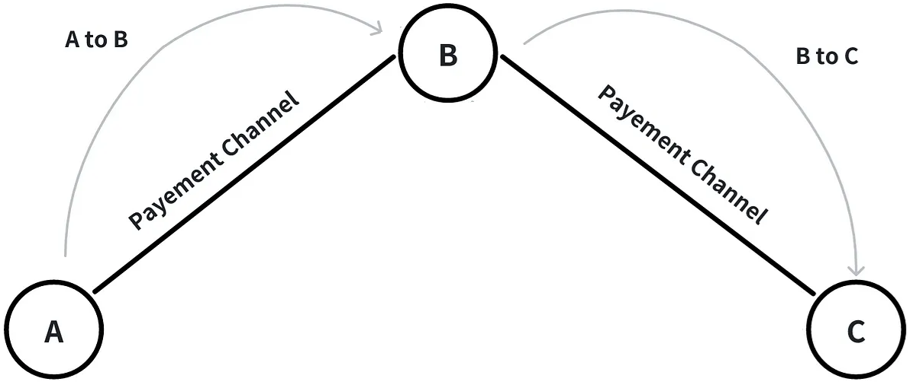
</p>

***Image:** Illustration of single and multiple-hop payments in the Lightning Network.*

After configuring the `lnd.conf` file, we can initiate our Lightning Network nodes using the following commands:
```bash
alice$ lnd --rpclisten=localhost:10001 --listen=localhost:10011 --restlisten=localhost:8001
bob$ lnd --rpclisten=localhost:10002 --listen=localhost:10012 --restlisten=localhost:8002
charlie$ lnd --rpclisten=localhost:10003 --listen=localhost:10013 --restlisten=localhost:8003
```

## Alice Node
- To create a wallet for Alice on her Lightning Network node:
```bash
alice$ lncli --rpcserver=localhost:10001 --macaroonpath=data/chain/bitcoin/simnet/alice.macaroon create
```
- To retrieve information about Alice's wallet and test it:
```bash
alice$ lncli --rpcserver=localhost:10001 --macaroonpath=data/chain/bitcoin/simnet/alice.macaroon getinfo
```
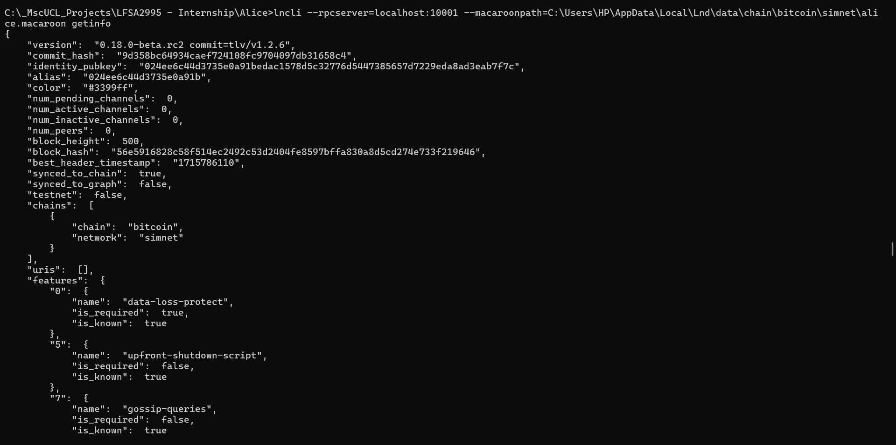

- To setup a Bitcoin address for Alice:
```bash
alice$ lncli --rpcserver=localhost:10001 --macaroonpath=data/chain/bitcoin/simnet/alice.macaroon newaddress np2wkh
```
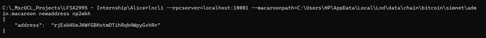

- for Funding Alice, we have to run this in a new terminal:
setting Alice as the recipient of all mining rewards
```bash
alice$ btcd --simnet --txindex --rpcuser=username --rpcpass=password --miningaddr=<ALICE_ADDRESS>
```
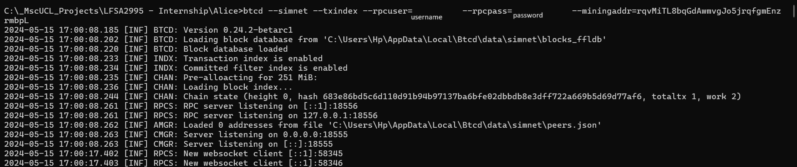

- Generate <number_of_blocks> blocks, so that Alice gets the reward:
```bash
alice$ btcctl --simnet --rpcuser=username --rpcpass=password generate <number_of_blocks>
```
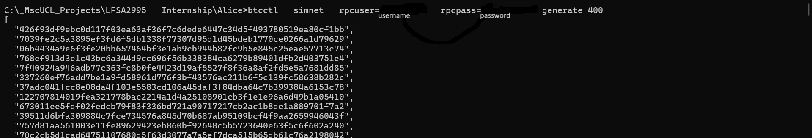

- Check that segwit is active
```bash
alice$ btcctl --simnet --rpcuser=username --rpcpass=password getblockchaininfo | grep -A 1 segwit
```
- Check Alice’s wallet balance.
```bash
alice$ lncli --rpcserver=localhost:10001 --macaroonpath=data/chain/bitcoin/simnet/alice.macaroon walletbalance
```
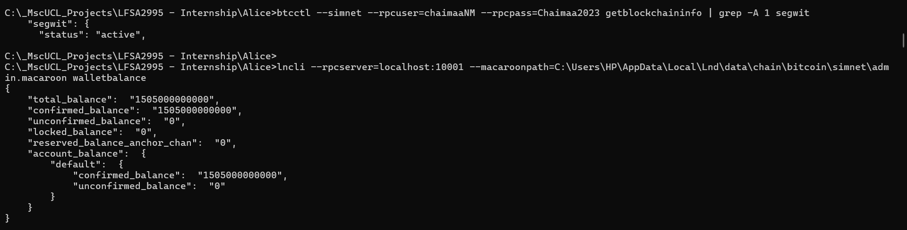

## Bob Node  
- To create a wallet for Bob on her Lightning Network node:
```bash
bob$ lncli --rpcserver=localhost:10002 --macaroonpath=data/chain/bitcoin/simnet/bob.macaroon create
```
- To retrieve information about Bob's wallet and test it:
```bash
bob$ lncli --rpcserver=localhost:10002 --macaroonpath=data/chain/bitcoin/simnet/bob.macaroon getinfo
```
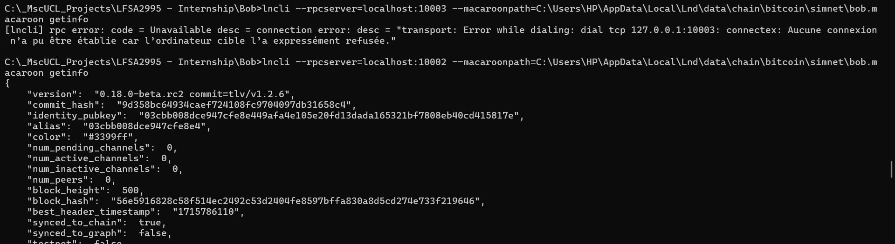

- To setup a Bitcoin address for Bob:
```bash
bob$ lncli --rpcserver=localhost:10002 --macaroonpath=data/chain/bitcoin/simnet/bob.macaroon newaddress np2wkh
```
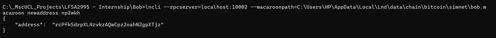

## Charlie Node
- To create a wallet for Charlie on her Lightning Network node:
```bash
charlie$ lncli --rpcserver=localhost:10003 --macaroonpath=data/chain/bitcoin/simnet/charlie.macaroon create
```
- To retrieve information about Charlie's wallet and test it:
```bash
charlie$ lncli --rpcserver=localhost:10003 --macaroonpath=data/chain/bitcoin/simnet/charlie.macaroon getinfo
```


- To setup a Bitcoin address for Charlie:
```bash
charlie$ lncli --rpcserver=localhost:10003 --macaroonpath=data/chain/bitcoin/simnet/charlie.macaroon newaddress np2wkh
```
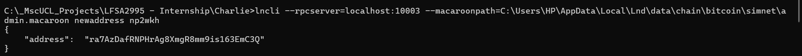

- for Funding Charlie, we have to run this in a new terminal:
```bash
charlie$ btcd --simnet --txindex --rpcuser=username --rpcpass=password --miningaddr=<CHARLIE_ADDRESS>
```
- Generate <number_of_blocks> blocks, so that Charlie gets the reward:
```bash
charlie$ btcctl --simnet --rpcuser=username --rpcpass=password generate <number_of_blocks>
```
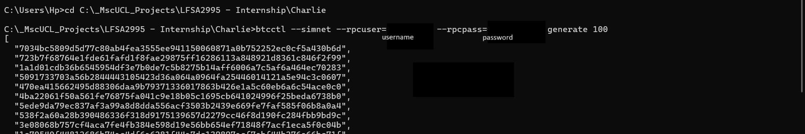

- Check that segwit is active
```bash
charlie$ btcctl --simnet --rpcuser=username --rpcpass=password getblockchaininfo | grep -A 1 segwit
```
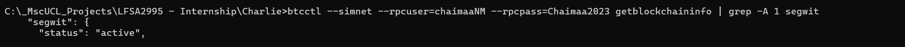

- Check Charlie's wallet balance.
```bash
charlie$ lncli --rpcserver=localhost:10003 --macaroonpath=data/chain/bitcoin/simnet/charlie.macaroon walletbalance
```
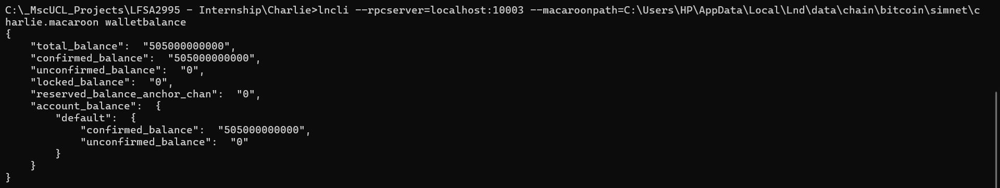
 
## Creating the P2P Network
**Connect Alice to Bob:**
1. **Get Bob's identity pubkey:**
```bash
bob$ lncli --rpcserver=localhost:10002 --macaroonpath=data/chain/bitcoin/simnet/bob.macaroon getinfo
```
2. **Connect Alice and Bob together:**
```bash
alice$ lncli --rpcserver=localhost:10001 --macaroonpath=data/chain/bitcoin/simnet/alice.macaroon connect <BOB_PUBKEY>@localhost:10012
```
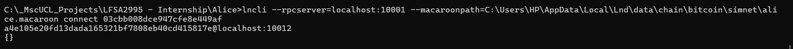

3. **Check that Alice has added Bob as a peer:**
```bash
alice$ lncli --rpcserver=localhost:10001 --macaroonpath=data/chain/bitcoin/simnet/alice.macaroon listpeers
```
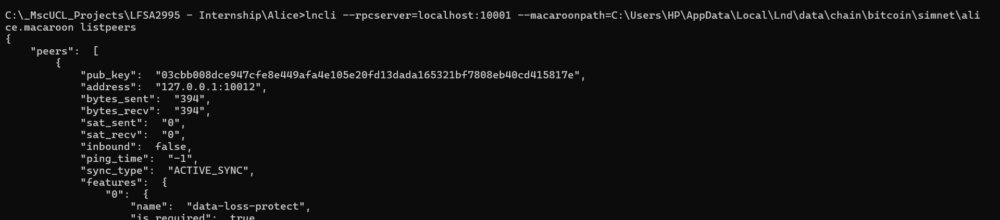

4. **Check that Bob has added Alice as a peer:**
```bash
bob$ lncli --rpcserver=localhost:10002 --macaroonpath=data/chain/bitcoin/simnet/bob.macaroon listpeers
```
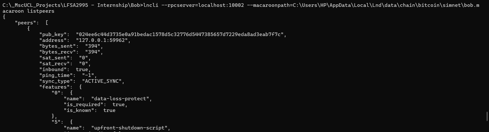

**Connect Bob to Charlie:**
```bash
charlie$ lncli --rpcserver=localhost:10003 --macaroonpath=data/chain/bitcoin/simnet/charlie.macaroon connect <BOB_PUBKEY>@localhost:10012
```
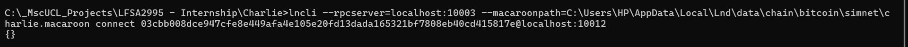

- Check that Charlie has added Bob as a peer:
```bash
charlie$ lncli --rpcserver=localhost:10003 --macaroonpath=data/chain/bitcoin/simnet/alice.macaroon listpeers
```
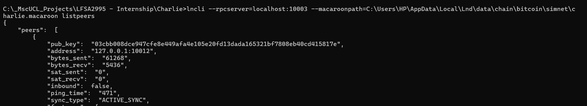

- Check that Bob has added Charlie as a peer:
```bash
bob$ lncli --rpcserver=localhost:10002 --macaroonpath=data/chain/bitcoin/simnet/bob.macaroon listpeers
```
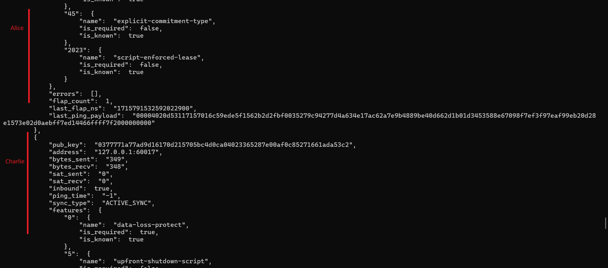

## Setting up Lightning Network
- Open the Alice<–>Bob channel:
```bash
alice$ lncli --rpcserver=localhost:10001 --macaroonpath=data/chain/bitcoin/simnet/alice.macaroon openchannel --node_key=<BOB_PUBKEY> --local_amt=1000000
```
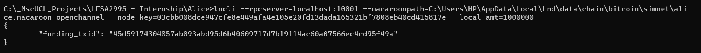

- We now need to mine six blocks so that the channel is considered valid:
```bash
alice$ btcctl --simnet --rpcuser=udername --rpcpass=password generate 6
```
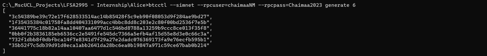

- Check that Alice<–>Bob channel was created:
```bash
    alice$ lncli --rpcserver=localhost:10001 --macaroonpath=data/chain/bitcoin/simnet/alice.macaroon listchannels
```
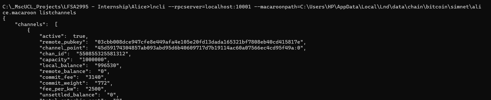

```bash
    bob$ lncli --rpcserver=localhost:10002 --macaroonpath=data/chain/bitcoin/simnet/bob.macaroon listchannels
```
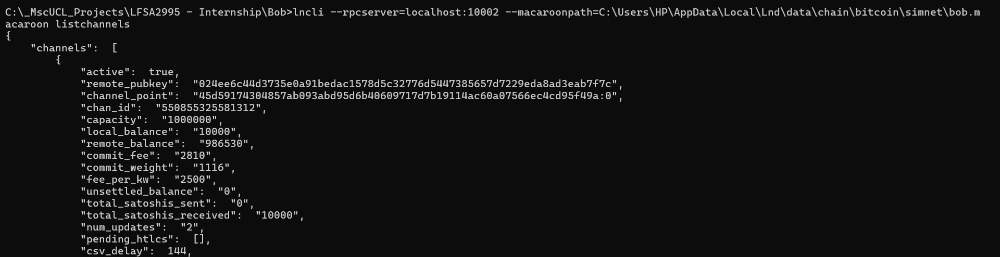

## Single-hop payments: Alice to Bob
- Bob will need to generate an invoice:
```bash
bob$ lncli --rpcserver=localhost:10002 --macaroonpath=data/chain/bitcoin/simnet/bob.macaroon addinvoice --amt=10000
```
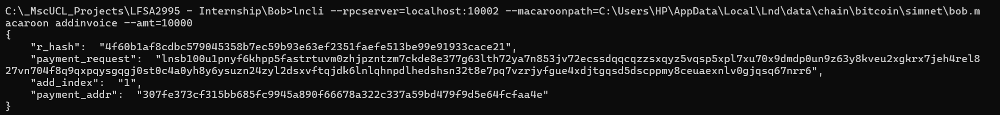

- Send the payment from Alice to Bob:
```bash
alice$ lncli --rpcserver=localhost:10001 --macaroonpath=data/chain/bitcoin/simnet/alice.macaroon sendpayment --pay_req=<encoded_invoice>
```
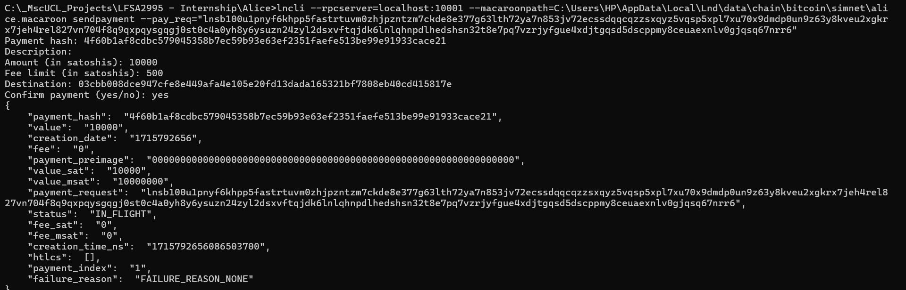

- Bob walletbalance:
```bash
alice$ lncli --rpcserver=localhost:10002 --macaroonpath=data/chain/bitcoin/simnet/bob.macaroon walletbalance
```
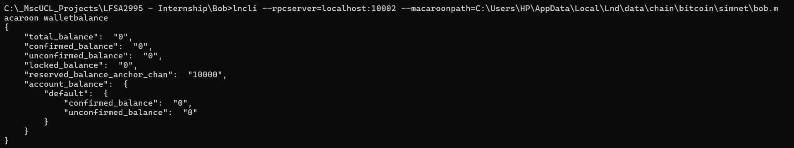

## Multiple-hop payments: Bob to Charlie


## To avoid errors

"[lncli] rpc error: code = Unknown desc = verification failed: signature mismatch after caveat verification"

"[lncli] rpc error: code = Unknown desc = the RPC server is in the process of starting up, but not yet ready to accept calls"


## .bashrc
To avoid repetition, you can save the necessary information in the `.bashrc` file using aliases for each Lightning Network node:
```bash
alias lncli-alice="lncli --rpcserver=localhost:10001 --macaroonpath=data/chain/bitcoin/simnet/alice.macaroon"
alias lncli-bob="lncli --rpcserver=localhost:10002 --macaroonpath=data/chain/bitcoin/simnet/bob.macaroon"
alias lncli-charlie="lncli --rpcserver=localhost:10003 --macaroonpath=data/chain/bitcoin/simnet/charlie.macaroon"
```

