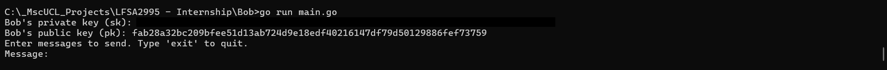
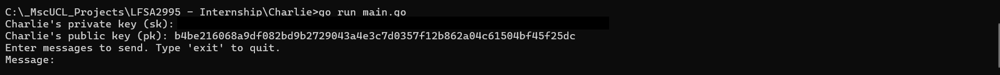
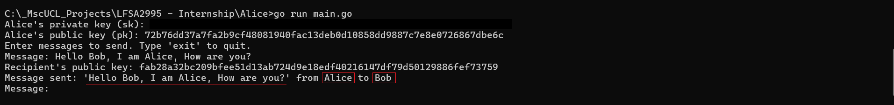
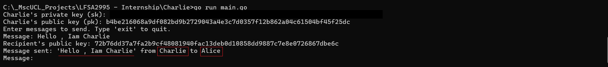
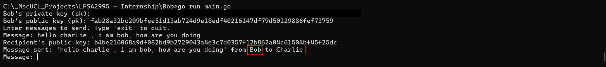

# Nostr Protocol - Decentralized Social Networking

Nostr Protocol enables decentralized social networking, prioritizing privacy and censorship resistance.

### Key Features?
- **Decentralized Messaging:** Direct communication between users without central servers.
- **Censorship Resistance:** Messages cannot be blocked or censored.
- **Privacy:** Secure message transmission without intermediaries accessing content.

### Components
#### **Clients:** Nostr clients enable users to:
- Connect securely to the decentralized network.
- Send and receive encrypted messages.
- Manage cryptographic keys for identity and security.

#### **Relays:** Relays form the infrastructure for:
- Routing messages across the decentralized network.
- Ensuring message privacy and network stability.
- Providing censorship-resistant communication channels.

**Nostr Documentation:** [D1](https://nostr.com/) & [D2](https://nostr.how/en/get-started)

## Nostr Protocol Prototype


### 1. Integration of Nostr Protocol

First, forked the original `go-nostr` repository from [nbd-wtf/go-nostr](https://github.com/nbd-wtf/go-nostr) to my GitHub account and cloned it to the local development environment.

```bash
git clone https://github.com/ChaimaaNairi/go-nostr.git
cd go-nostr
```

Initialized Go modules to manage dependencies and ensure proper configuration.
```bash
go mod init github.com/ChaimaaNairi/go-nostr
go mod tidy
```

Built and ran the project locally to verify integration and functionality.
```bash
go build
./go-nostr
```

### 2. Generating Keys for Each Node (Alice, Bob, and Charlie)

To ensure secure authentication and messaging within the Nostr Protocol network, each node (Alice, Bob, and Charlie) requires unique key pairs.

1. **Generating Keys for Alice:**
   - In [main.go](https://github.com/ChaimaaNairi/Lightning-Nostr-Prototype/blob/main/Alice/main.go), the `generateNewKeys()` function generates keys for Alice and saves them in `keys_alice.json` to maintain consistency across runs.

     ```bash
     go run main.go alice
     ```
    


2. **Generating Keys for Bob:**
   - In [main.go](https://github.com/ChaimaaNairi/Lightning-Nostr-Prototype/blob/main/Bob/main.go), the `generateNewKeys()` function generates keys for Alice and saves them in `keys_bob.json` to maintain consistency across runs.
     ```bash
     go run main.go bob
     ```
    


3. **Generating Keys for Charlie:**
   - In [main.go](https://github.com/ChaimaaNairi/Lightning-Nostr-Prototype/blob/main/Charlie/main.go), the `generateNewKeys()` function generates keys for Alice and saves them in `keys_charlie.json` to maintain consistency across runs.
     ```bash
     go run main.go charlie
     ```
    

### 3. Setup Relay Server
Within the forked `go-nostr` repository, we've added a custom relay server implementation to facilitate decentralized messaging across nodes.
- In the `cmd` folder of the repository, locate [relay_server.go](https://github.com/ChaimaaNairi/go-nostr/blob/master/cmd/relay_server.go)

     ```bash
        go run cmd/relay_server.go
     ```


### 4. Integrating Nodes with Nostr Protocol
Once the relay server is set up, the next step involves integrating nodes (Alice, Bob, and Charlie) with the Nostr Protocol to enable secure messaging and communication.

- Each node (Alice, Bob, Charlie) connects securely to the relay server.
- Nodes utilize their respective keys (stored in `keys_alice.json`, `keys_bob.json`, `keys_charlie.json`) for authentication and message encryption.
- Nodes can send and receive encrypted messages through the relay server.

**From Alice to Bob**


**From Charlie to Alice**


**From Bob to Charlie**


### 5.Offline Message Storage with IPFS Integration
To ensure nodes (Alice, Bob, and Charlie) can receive messages even when offline, we integrate IPFS (InterPlanetary File System) for decentralized storage and retrieval of messages within the Nostr Protocol network.

1. IPFS Integration
- Implemented IPFS client functionality using `go-ipfs-api` for seamless interaction with the IPFS network.
- Ensured connectivity to the IPFS daemon and verified operational status.

[ipfs_integration.go](https://github.com/ChaimaaNairi/go-nostr/blob/master/cmd/ipfs_integration.go)


